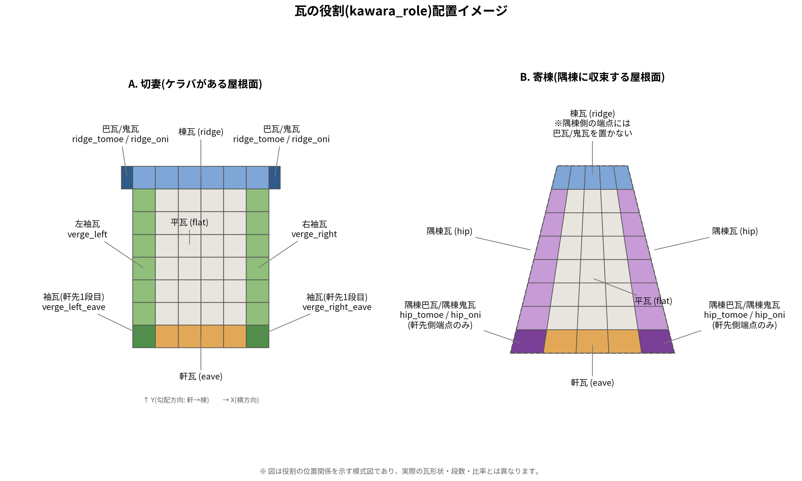
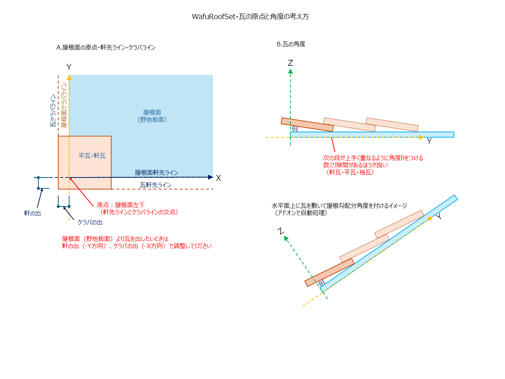

# WafuRoofSet 瓦セット作成ガイド

WafuRoofSetアドオンで使う「瓦セット」(Blenderコレクション)を、自分で用意した瓦の3Dパーツから作るための手引きです。`kawara_sample.blend`(テスト瓦セット、洋瓦風・かぶせタイプ)と`万十瓦セット.blend`(Ｊ形－53A_万十軒、和瓦・絡むタイプ)の実際の中身を比較して、共通のルールと、セットの性格によって省略してよい部分を整理しています。

## 1. 全体の考え方

このアドオンは「瓦メーカーの図面を見なくても、似た納まりの屋根が作れるようにする」ためのものです。図面が本来持っている知識(引っ掛け位置・働き幅/働き長さ・重なり方)を、あらかじめ瓦セットの**原点**と**カスタムプロパティの数値**に埋め込んでおけば、使う人はその後、図面を意識せずボタンを押すだけで済みます。

裏を返すと、**セットを作る工程だけは、多少の手間と正確さが必要**です。ここでのミスは、使う側からは気づく手段がほとんどありません。

## 2. 必要なオブジェクト(役割)

コレクションの中に、以下の役割の瓦オブジェクトを用意します。役割は`kawara_role`というカスタムプロパティ(文字列)で指定するのが確実です。

下図は、各役割が屋根面上のどこに対応するかを示した模式図です(実際の瓦形状・段数・比率とは異なります)。Aはケラバがある切妻側の屋根面、Bは隅棟に収束する寄棟側の屋根面です。

| 役割 | `kawara_role`の値 | 必須/任意 | 説明 |
|---|---|---|---|
| 平瓦 | `flat` | 必須 | 屋根面全体に敷く基本の瓦。全体のグリッドの基準になる |
| 軒瓦 | `eave` | 任意(無いと軒瓦は敷かれない) | 軒先の1段目。専用形状でなければ平瓦の複製でよい |
| 左袖瓦 | `verge_left` | 任意 | ケラバ(妻)の左側 |
| 右袖瓦 | `verge_right` | 任意 | ケラバの右側 |
| 左袖瓦(軒先1段目用) | `verge_left_eave` | 任意 | 左袖瓦のうち、軒に一番近い1段目だけ専用形状にしたい場合 |
| 右袖瓦(軒先1段目用) | `verge_right_eave` | 任意 | 同上、右側 |
| 棟瓦 | `ridge` | 任意 | 棟(大棟)のライン本体 |
| 巴瓦 | `ridge_tomoe` | 任意 | 棟の妻側(ケラバに落ちる側)の端部装飾 |
| 鬼瓦 | `ridge_oni` | 任意 | 棟の端部装飾(巴瓦とセットで使われることが多い) |
| 隅棟瓦 | `hip` | 任意 | 隅棟のライン本体 |
| 隅棟巴瓦 | `hip_tomoe` | 任意 | 隅棟の軒先側端部の装飾(巴瓦相当) |
| 隅棟鬼瓦 | `hip_oni` | 任意 | 隅棟の軒先側端部の装飾(鬼瓦相当) |

これが現時点での役割の全種類です。将来アドオン側で役割が追加された場合、ここに載っていない値を`kawara_role`に入れても無効な値として扱われ、次の「名前での判定」にまわされるので注意してください。

### 軒瓦(`eave`)を省略する場合の注意

軒瓦は完全に任意で、無くても屋根は問題なく生成されます。軒瓦が無い場合、平瓦がケラバの一番軒先側の行までそのまま敷かれます(軒瓦がある場合は、その行は平瓦を避けて空けておく仕様です)。

実物のカタログで軒瓦と平瓦の区別が無い瓦(F型など)は、あえて軒瓦を省略して構いません。「はみ出た平瓦をカット」を行っても、軒先側の辺は常にカット対象から除外される(軒瓦・袖瓦のカットと同じ考え方)ので、軒瓦が無いことで軒先が不自然な直線でスパッと切られる心配はありません。

### 袖瓦(軒先1段目用)の挙動補足

`verge_left_eave`/`verge_right_eave`は、袖瓦ラインの一番軒に近い1点目だけこちらを使い、2点目以降は通常の袖瓦(`verge_left`/`verge_right`)に切り替わります。かぶせタイプ・絡むタイプのどちらでも同じロジックで動作し、セットの性格による制限はありません(用意するかどうかは、そのセットの実物カタログに軒先専用形状があるかどうかで決めてください)。

### 役割の指定方法(2通り)

1. **`kawara_role`属性(推奨)**: 各オブジェクトのカスタムプロパティに、上の表の値を直接設定する。名前が何語でも(英語でも日本語でも)確実に認識される。
2. **名前での判定(フォールバック)**: `kawara_role`が無い、または上の表に無い値の場合のみ、オブジェクト名に含まれる文字列で自動判定する。判定は上から順に行われ、先に一致した方が優先されるので、次の順序に注意してください。

   「隅棟」→「右袖軒」→「左袖軒」→「右袖」→「左袖」→「軒瓦」→「巴」→「鬼」→「棟」→「平」

   「隅棟巴瓦」のような名前は、この順序だと「隅棟」が先に一致してしまい、`hip`(隅棟瓦本体)に巻き込まれます。**隅棟巴瓦・隅棟鬼瓦は、名前判定だけに頼らず`kawara_role`属性を明示的に設定してください**(実際に検証した際、この2つは名前判定だけでは正しく振り分けられませんでした)。

## 3. 原点の決め方(最重要)

- **原点 = 瓦の重なりの起点(引っ掛け位置)**。実物の瓦で言えば、引っ掛け桟(または爪)がかかる位置。瓦メーカーの図面が「瓦の中心」ではなく「屋根面からの距離」で寸法を管理しているのと同じ考え方です。
- **ローカルX軸 = 横方向**(隣の瓦へ向かう向き)
- **ローカルY軸 = 勾配方向**(軒先→棟へ向かう向き、瓦の「上下」)
- **ローカルZ軸 = 瓦の厚み方向**(表を向く向き、法線)
- オブジェクトの位置・回転・スケールは、必ず適用(`Ctrl+A`で全て0/1)しておく。

### なぜ瓦のメッシュに角度θが付いているのか

上の図(B)の通り、瓦には厚みがあるため、水平な基準面の上でそのまま重ねて敷こうとすると、隙間ができるかどちらかがめり込むかのどちらかになります。次の段の瓦が上手く重なるように、メッシュ自体にあらかじめ角度θを付けて作っておく必要があります(θの値は計算式で出すというより、メーカーの水平展開図を見ながら現物合わせで決めるものです。ゼロぴったりを狙うより、数ミリ隙間を残す方が安全です)。

このθは平瓦・軒瓦・袖瓦で共通の値にしてください。役割ごとに角度が違うと、どこかの継ぎ目で段差や隙間が出ます。

アドオン側は、この「水平面上でθを付けて作られたセット」を、屋根の勾配に合わせて1回転させるだけです(`_rotation_euler`によるオブジェクト単位の回転)。瓦の厚み・重なり方そのものはメッシュ側にすべて作り込まれている前提のため、配置計算側は勾配角度・ピッチ以外の情報を必要としません。

### 原点とメッシュのY方向の範囲(以下「Y範囲」)が特に重要

平瓦・袖瓦・軒瓦のように**ピッチで繰り返し配置される瓦**は、原点から見て、メッシュがY方向(勾配方向)にどこからどこまで伸びているか(以下「Y範囲」と呼びます)を、平瓦を基準として全部揃える必要があります。実際に2つのセットを調べたところ:

| セット | オブジェクト | Y範囲(原点基準、単位はメートル) |
|---|---|---|
| 万十瓦セット | 平瓦 | -0.060 〜 +0.248 |
| 万十瓦セット | 左袖 | -0.060 〜 +0.248 (平瓦と一致) |
| 万十瓦セット | 軒瓦・左袖軒・右袖軒 | -0.083 〜 +0.248 (平瓦とは軒側だけ異なる。後述) |
| テスト瓦セット | 平瓦01・軒瓦01・左袖01・右袖01 | ほぼ全部 -0.050 〜 +0.300 で一致 |

これが揃っていないと、ピッチ通りの位置に置いても瓦同士が段差なく噛み合いません。過去に実際、右袖だけこの範囲が15mmズレていて、袖瓦の2段目以降が棟側に寄って見える不具合が起きたことがあります。**平瓦をコピーして袖瓦・軒瓦を作る場合、原点だけは絶対に動かさないでください**(全選択して移動する時に、原点も一緒に動かしてしまうミスが起きがちです)。

軒瓦だけは例外で、**横方向(X)のピッチだけ平瓦と揃っていれば十分**で、縦方向(Y)は自由です(軒先に1回しか配置されず、ピッチで繰り返されないため)。ただし今回調べた2セットとも、軒瓦のY方向は結果的に「軒側だけ少し延びている」以外は平瓦相当と揃えてありました。

## 4. 寸法の関係

- メッシュ本体は、働き幅・働き長さ(それぞれ横方向・縦方向の見え掛かり寸法)より一回り大きく作る(実際に重なり合うため)。例: 万十瓦セットの平瓦は働き幅265mmに対し実寸305mm、働き長さ250mmに対し実寸(原点基準で)約308mm。
- 平瓦・軒瓦には、`kawara_tile_width_mm`(・`kawara_tile_height_mm`)を数値(mm)で入れておくと、割付計算が「最後の1枚は次の瓦に重ねてもらえない」ことを考慮して枚数・ピッチを調整してくれます。無くても動きますが、単純な「長さ÷ピッチ」の計算になり、最後の1枚がはみ出しやすくなります。
- 割付がシビアでない(かぶせタイプなど、多少の誤差を後工程のカットで吸収できる)セットでは、この属性は無くても問題ありません(テスト瓦セットには付いていません)。

## 5. 袖瓦のオフセット(`kawara_flat_offset_mm`)

袖瓦が「かぶせ」ではなく「敷く(絡む)」タイプ(万十瓦セットなど)の場合、袖瓦オブジェクト自身に`kawara_flat_offset_mm`(mm、数値)を設定すると、平瓦・軒瓦の1枚目の位置がケラバからその分だけ内側にずれて敷かれます(袖瓦と平瓦の1枚目が重ならないようにするため)。

- 万十瓦セット: 左袖=265、右袖=205(左右で値が違ってよい)
- テスト瓦セット: 設定なし(かぶせタイプなので、平瓦はケラバの位置からそのまま敷き始めればよい)

この属性が無い場合は0として扱われ、オフセット無しの従来通りの動作になります。

**注意**: この属性がセットに存在しても、実際の屋根面のその辺が境界(ケラバ)でない場合(隅棟などで隣の面と繋がっている辺の場合)は、オフセットは適用されません。逆に言うと、セット側で気にする必要は無く、面の形状に応じて自動で判定されます。

## 6. コレクションに寸法をあらかじめ埋め込む(任意)

コレクションのカスタムプロパティに、以下のキーで数値(mm)を設定しておくと、コレクションを選んだ時に自動で寸法スペックへ反映されます。

| キー | 内容 |
|---|---|
| `kawara_hataraki_haba` | 働き幅(横ピッチ) |
| `kawara_hataraki_nagasa` | 働き長さ(段ピッチ) |
| `kawara_mune_pitch` | 棟のピッチ |
| `kawara_sumi_mune_pitch` | 隅棟のピッチ |
| `kawara_chousei_sunpo` | 調整可能寸法(±mm) |
| `kawara_kerava_overhang_mm` | ケラバの出(mm) |
| `kawara_eave_overhang_mm` | 軒の出(mm) |
| `kawara_chidori` | 千鳥敷き(真偽値)。trueで平瓦を千鳥状に敷く(詳細は次項) |

後半の2つ(ケラバ・軒の出)は、屋根面の幅に対して「割付計算(枚数)にだけ」効かせる仮想的な広がりです。位置そのものは動かしません。割付がシビアでないセットでは、この2つは0のままで問題ありません。

`調整可能寸法`(chousei_sunpo)を0にすると、ピッチは本来の値に固定され、はみ出た分は後工程のカットで整える前提になります。かぶせタイプのように、そもそも割付の厳密さが求められないセットでは、この考え方(敷いてからカット)を前提にしてよいです。

### 千鳥敷き(`kawara_chidori`)について

F型瓦などでよく見る、平瓦を1段おきに半ピッチ(働き幅の半分)ずつX方向にずらして敷く「千鳥」パターンに対応しています。コレクションのカスタムプロパティ`kawara_chidori`をtrueにするだけで有効になります。

- 軒に一番近い1段目(基準の段)はずらさず、そこから1段おきに半ピッチずつずれます(1段目からずれてしまうと軒瓦・ケラバとの取り合いがおかしくなるため、意図的にこの段だけ基準通りにしています)。
- ずれた段はケラバの外側にはみ出すことがありますが、これは想定内の動作です。はみ出た分は、通常通り「はみ出た平瓦をカット」を実行すれば、他の役物(袖瓦・軒瓦)と同じ考え方でケラバ・軒先の形に沿って切り落とされます。
- 千鳥敷きは平瓦の配置ロジックのみに影響します。袖瓦・軒瓦・棟・隅棟などの配置や、`kawara_flat_offset_mm`との組み合わせにも問題なく対応しています。
- かぶせタイプ・絡むタイプのどちらでも使えますが、性質上、割付がシビアでないかぶせタイプ(F型など)との相性が良いパターンです。

## 7. 棟・隅棟の端部装飾(巴瓦・鬼瓦)

棟・隅棟は、本体(`ridge`/`hip`)だけあれば動きます。巴瓦・鬼瓦(`ridge_tomoe`/`ridge_oni`/`hip_tomoe`/`hip_oni`)は無くても静かに省略されるだけで、エラーにはなりません(テスト瓦セットには元々ありません)。

用意する場合の実際の挙動:

- 棟の両端点を「ケラバに落ちる側」か「隅棟に収束する側」か自動判定し、ケラバ側だけ巴瓦・鬼瓦を配置します(隅棟収束側は鬼瓦だけ)。
- 隅棟は軒先側の端点(始点)にだけ巴瓦・鬼瓦を配置します(棟との合流点側には何も配置しません)。
- 巴瓦がある場合、本体の敷き始めは巴瓦の幅の分だけ自動的に内側にずれます(巴瓦と本体が重ならないように)。
- 隅棟巴瓦・隅棟鬼瓦は、実際に検証した限り、棟の巴瓦・鬼瓦をそのまま流用(リンク複製)するだけで問題なく動きました。形状を作り直す必要は基本的にありません。

## 8. セットの性格による違い(絡むタイプ 対 かぶせタイプ)

| 項目 | 絡むタイプ(万十瓦セットなど) | かぶせタイプ(テスト瓦セットなど) |
|---|---|---|
| `kawara_flat_offset_mm` | 必要(袖瓦と平瓦が正確に噛み合う必要があるため) | 不要 |
| `kawara_tile_width_mm`/`height_mm` | 推奨(はみ出し防止) | 無くてもよい |
| ケラバ・軒の出(overhang) | 割付計算に影響するので必要なら設定 | 0のままでよい |
| 原点とY範囲の整合 | 厳密に揃える必要あり(揃わないと段差が見える) | ある程度揃っていれば十分(役物が覆うため) |
| 巴瓦・鬼瓦などの役物 | あれば見栄えが良い | 無くても成立する |

つまり、**このガイドの前半(役割・原点の基本ルール)はどちらのタイプにも共通して必須**ですが、後半(オフセット・overhang・tile_width・役物)は、割付の厳密さが求められるセットほど丁寧に用意する、という考え方で大丈夫です。

## 9. セット作成後のセルフチェック

作り終えたら、次を確認すると今回のようなミスを防げます。

1. 各オブジェクトの位置・回転・スケールが適用済み(0/1)になっているか
2. 平瓦をコピーして作った軒瓦・袖瓦の原点が、コピー時のまま動いていないか(疲れている時ほど見落としがちです)
3. 繰り返し配置される瓦(平瓦・左右袖瓦)同士で、原点基準のY範囲がほぼ一致しているか(Blender画面上部の「Scripting」タブに切り替えると出てくるPython実行欄で、各オブジェクトの頂点Y座標の最小・最大を見比べるだけで確認できます)
4. `隅棟巴瓦`・`隅棟鬼瓦`には`kawara_role`属性を明示しているか(名前判定だけでは棟本体と衝突します)

## 10. 既知の制限: 凹形状(L字など)は正式サポート外

平瓦の配置・カット自体は凹形状でも正しく動きますが、軒瓦・袖瓦の「どの辺が軒先/ケラバか」の判定は単純な四角形が前提です。凹形状だと段差の辺と本物のケラバを取り違える可能性があります。

対応策(手動):

- 複雑な形状は、最初から凸な四角形の集まりとして作る
- 足りない部分は、そこだけ独立した小さな面を追加して埋める
- 最終的な凹み・切り欠きは、瓦を敷き終えてからシンプルな箱を使ったブーリアンモディファイア(差分)で削る
- 合わない部分は、うまく敷けた瓦をコピー&移動して埋める
